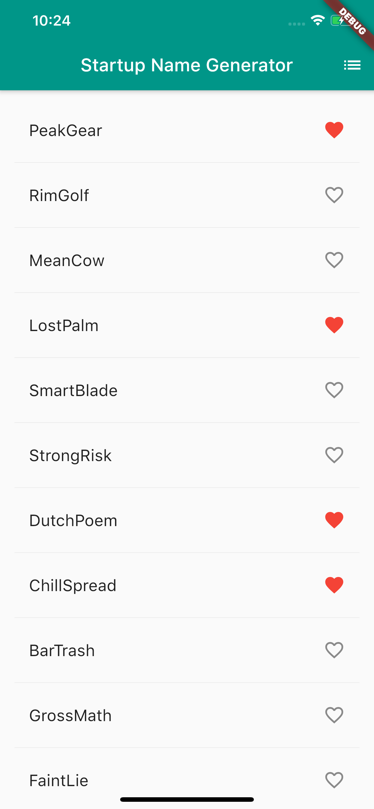
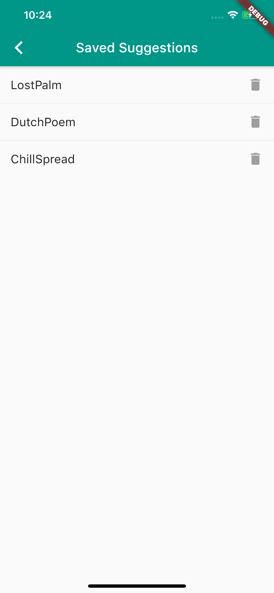

# Startup Namer

My first project using Flutter

### Background
Typically I'm a JS/TS guy but I wanted to put Flutter/Dart through the ringer. It was interesting to me to see how similar some of the Dart Syntax is to Javascript which would be interesting if I ever decided to jump into it.

### Summary
I already knew React Native so I was coming in with some high mobile expectations.
First, I was absolutely blown away by Flutter's VSCode plugin.
So far, it's been far better than the majority of other plugins that I've used.

The language seemed difficult at first but there's a clear entry point so I got moving.
At first I chose to forego any routing setup and build everything in a single layer (poor choice).
I went about understanding the initial class setup, adding some basic state and some tile states and created my first couple of widgets.

From there I created the list, scrolled around a bit seemed really responsive even in the debug mode (soon learned how to turn that off).
I added the functionality to populate the list with more results as you scrolled and even far down the list it was really responsive (although the state model of using .contains over an array won't for very long).

After adding the functionality to add/remove startup names I actually went about attempting to remove them from the saved list and had no luck.
My assumption was that it had to do something with me not able to pass an instance of state back and forth between that pushed navigator (I was right).
In React, the typical approach here is to use some sort of context so I searched "Flutter Context" and was surprised to see a very similar architecture to React's Context API.

After implementing context I did some conditional rendering to display a message when the list is empty and clocked the app there.

### TLDR;

A couple of things I touched on while learning:
- Virtual Scaffold
- Builder
- Reusable Styles
- Swipe to Refresh
- Conditional Rendering
- Context
- Icons
- Lists, List Tiles, Trailing Actions, Populating with next items
- Widget Composition

Overall surprisingly pleased with the outcome of the app and I'd probably use the language again on a future endeavour. It's odd being out of Javascript land but it's refreshing to get a first class language with types to do mobile with that isn't a nightmare. Check it out if you haven't yet.

Name List | Saved Names
------------ | -------------
 | 
